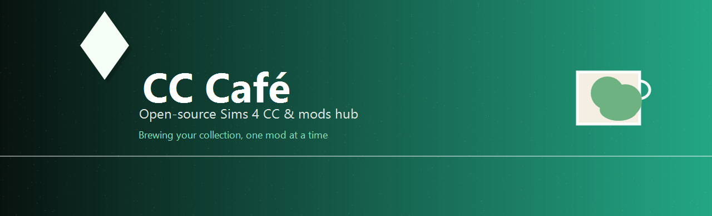

CC Café is an open-source Sims 4 mod manager built as a monolithic Electron + Next.js desktop app.

## What It Does

- CurseForge browse, creators, downloads, and updates
- Local mod import and profile management
- Fake mod detection and reporting
- S4MM-style tools for duplicate scans, CC package analysis, ID conflict checks, polygon scans, empty folder cleanup, and pack disable commands
- Sims Log Enabler installation and game log viewing

## Repository Layout

```
CC Café/
├── app/       # Electron + Next.js application
├── assets/    # Repo-level artwork and banner assets
├── scripts/   # Small repo helpers
└── updates/   # Update manifest output placeholder
```

## Prerequisites

- Node.js 18 or newer
- npm 9 or newer

## Setup

```bash
cd app
npm install
```

## Development

```bash
cd app
npm run dev
```

## Build

```bash
cd app
npm run build
```

## Tests

```bash
cd app
npm test
npm run lint
```

## Notes

- The runtime is Electron-based.
- The top-level `updates/` folder is kept for release artifacts and manifest output.

